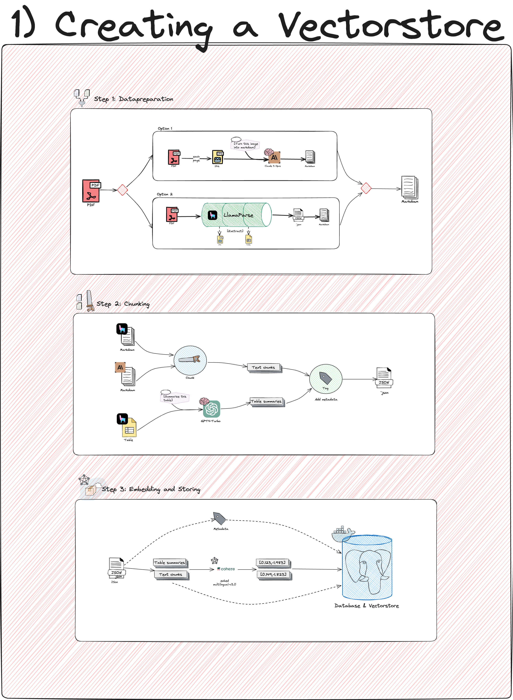
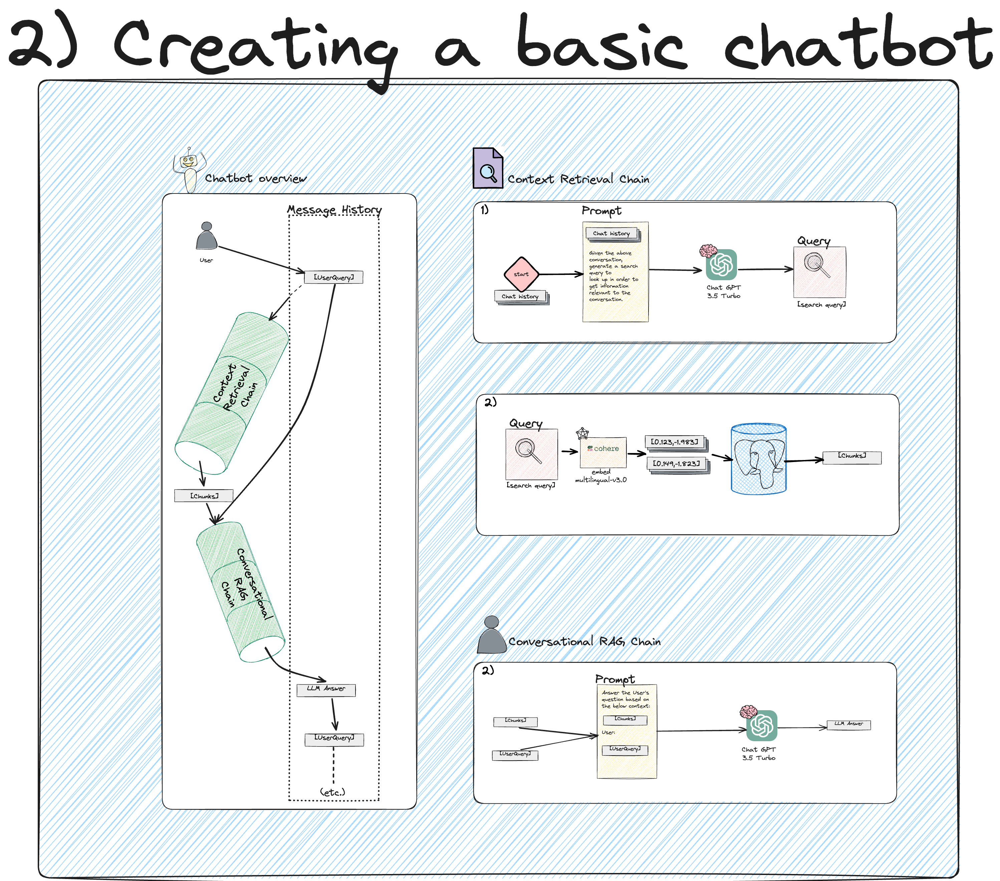
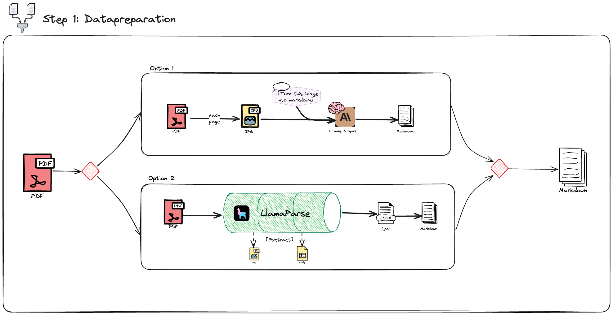
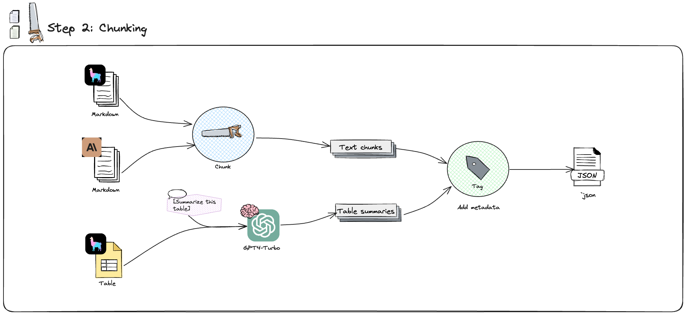
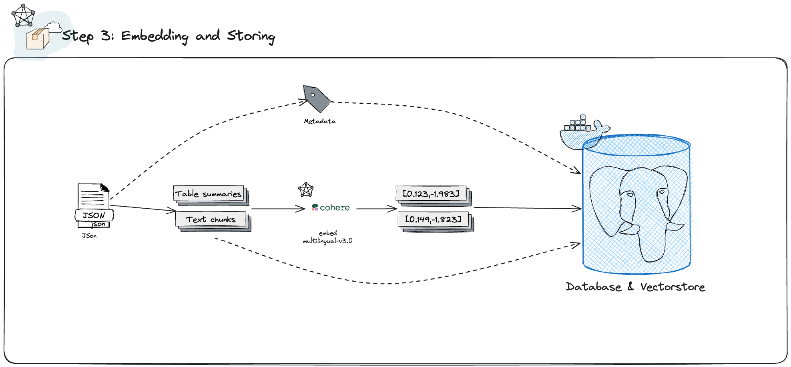
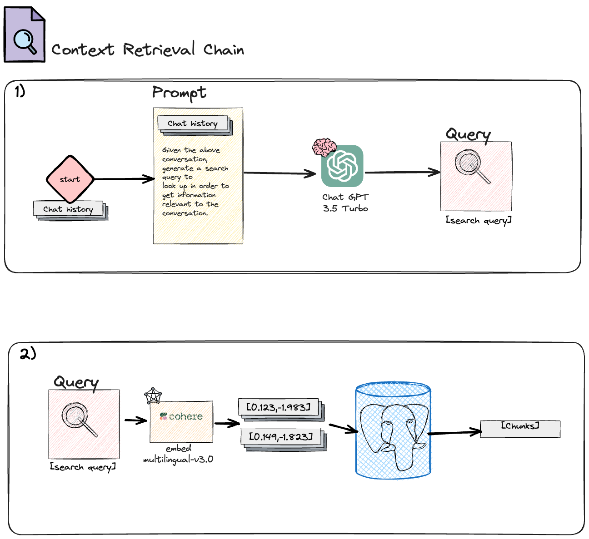
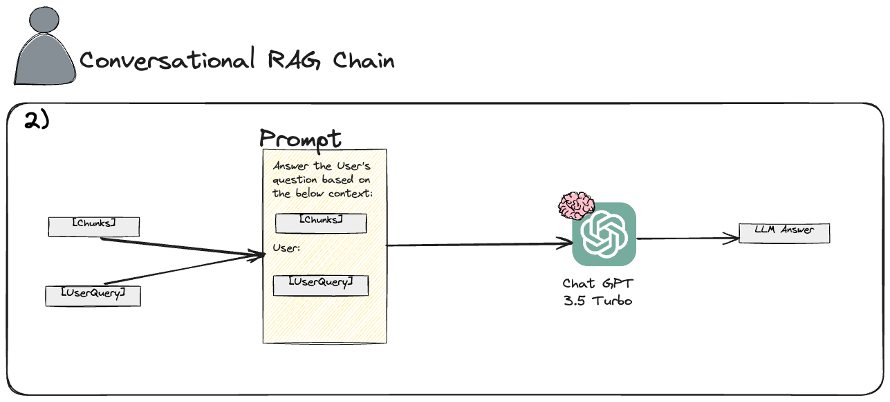
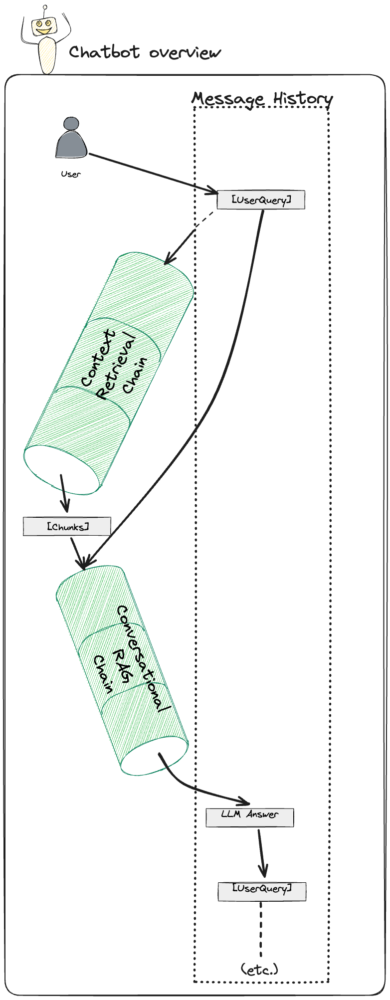

# RAG chatbot

RAG Chatbot Project for complex, unstructured pdfs. 




## Table of Contents

- [Introduction](#introduction)
- [Project Structure](#project-structure)
- [Step by Step walkthrough](#step-by-step-walkthrough)
  - [Setting up your environment](#setting-up-your-environment)
  - [Dataprep](#dataprep)
    - [Dataprep with Claudevision](#dataprep-with-claudevision)
    - [Dataprep with Llamaparse](#dataprep-with-llamaparse)
  - [Chunking](#chunking)
  - [Configuring PGVector Database](#configuring-pgvector-database)
  - [Embedding](#embedding)
  - [Basic Chatbot](#basic-chatbot)

## Introduction

This repository is a personal learning project for me to experiment with LLMs, AI and even developing in general. 
See blog posts (in Dutch): 
[Part 3](https://janwillemaltink.eu/blog/ai-blog-deel-3-retrieval-augmented-generation).
[Part 4](https://janwillemaltink.eu/blog/blogartikelen/ai-blog-deel-4-rag-langchain)

Bigger version of the visuals: [Excalidraw](https://link.excalidraw.com/readonly/lv6ZpqrKnLg3jKkZizch)

### Some core components:

- [Langchain](https://github.com/langchain-ai/langchain)
- [Langchain Postgres](https://github.com/langchain-ai/langchain-postgres)
- [Cohere](https://github.com/langchain-ai/langchain)
- [LlamaParse](https://github.com/run-llama/llama_parse)

## Project Structure

Below is an overview of the project structure.

```plaintext
.
├── README.MD
├── .gitignore
├── .env.example
├── .env
├── documents
├── data
├── requirements.txt
├── Creating_a_vectorstore
│   ├── 03b_EMBED_AND_STORE
│   │   └── 01_storing.py
│   ├── 03a_DOCKER_PGVECTOR_DATABASE
│   │   ├── README.md
│   │   └── 01_add_extension.py
│   ├── 02_CHUNKING
│   │   └── 01_chunking.py
│   ├── 01_DATAPREP
│   │   ├── 01b_DATAPREP_WITH_LLAMAPARSE
│   │   │   ├── table_summary_prompt.txt
│   │   │   ├── 03_summarize_and_restructure_table_items.py
│   │   │   └── 02_split_json_in_pages_and_items.py
│   │   └── 01a_DATAPREP_WITH_CLAUDEVISION
│   │       ├── image_to_md_prompt.txt
│   │       ├── 02_imagefolder_to_md.py
│   │       └── 01_pdf_to_image.py
└── Basic_Chatbot
    └── chat.py
```

## Walkthrough

### Setting up your environment

- create virtual environment
- Install requirements
- Get API keys
- Configure .env file

### Dataprep



#### Dataprep with Claudevision

The `01_pdf_to_image.py` script converts each page of a PDF file into separate image files at the specified DPI. The image files are saved in the specified output directory with the original PDF's title plus the page number in the filename.

The `02_imagefolder_to_md.py` script processes images in a folder and converts them to markdown files using the Anthropic API. It reads the images, sends them along with a prompt to the API, and saves the generated markdown content to separate files.

#### Dataprep with Llamaparse

The `01_pdf_to_json.py` script uses the Llama Parse library to convert a PDF document into a JSON format. It saves the JSON result and downloads the images from the PDF, storing them in a separate directory.

The `02_split_json_in_pages_and_items.py` script processes the JSON result from the previous step. It splits the JSON data into separate markdown files for each page and JSON files for each item (text or header) within the pages. The text items are further split into chunks based on a maximum chunk size.

The `03_summarize_and_restructure_table_items.py` script processes JSON files containing table data and generates summaries for each table using the OpenAI API. It reads a prompt from a file and uses it along with the table data to generate the summary. The script then restructures the JSON data by creating a new JSON object that includes the generated summary, metadata, and the original markdown table. The restructured JSON data is saved to a new file in the output directory. The script processes all JSON files in the specified input directory and saves the restructured data to the corresponding files in the output directory.

### Chunking



The `01_chunking.py` script performs the following tasks:

1. It defines a `Document` dataclass to represent a document with content and metadata.
2. The `generate_documents` function takes the content of a markdown file, splits it into smaller chunks based on headers and a maximum chunk size, and creates `Document` objects with the appropriate metadata for each chunk.
3. The `create_metadata` function generates metadata for each chunk, including a unique ID, source name, page number, collection, embeddings model, and character count.
4. The `create_documents_from_markdown_file` function reads a markdown file and calls `generate_documents` to create `Document` objects from the file's content.
5. The `save_documents_to_json` function saves the `Document` objects to a JSON file in the specified output directory.
6. In the `__main__` block, the script iterates over markdown files in a directory, creates `Document` objects for each file using the specified parameters (collection, embeddings model, max chunk size), and saves the documents to JSON files in the output directory.

Overall, this script takes markdown files, splits them into smaller chunks, creates `Document` objects with metadata for each chunk, and saves the documents to JSON files for further processing.

### Configuring PGVector Database

Setting up the PGVector Database:

For our database needs, we utilize PostgreSQL with the PGVector extension to manage and query vector data efficiently. The database setup and initialization are facilitated using Docker to ensure a smooth and consistent environment across different systems. For detailed instructions on configuring and running the PGVector database, please refer to the specific README.md file located in the database setup folder.

### Embedding and storing



Embedding and Storing with PGVector
The embed_and_store.py script facilitates the storage of document vectors in a PGVector database using Cohere's multilingual embeddings. This script performs several essential tasks:

1. Database Connection: It constructs a connection string using the loaded environment variables, which is later used to connect to the PGVector database.

2. Document Embedding: Utilizing the CohereEmbeddings class with the embed-multilingual-v3.0 model, the script converts textual content into vector embeddings. This process is essential for enabling efficient searching and similarity comparisons within the database.

3. Processing JSON Documents: The script recursively searches for JSON files within a specified directory and its subdirectories. For each JSON file, it:

4. Reads the content and metadata.
Initializes a PGVector instance for storing document vectors, specifying the collection name and embedding model.
Converts each item's content and metadata into a Document object.
Adds the document vectors to the PGVector database.

### Basic Chatbot

This section of the project demonstrates the integration of a retrieval-augmented generation (RAG) chatbot using various technologies including LangChain, OpenAI's language models, and a PGVector-based vector store. The main objective of this chatbot is to handle conversational queries by retrieving relevant context from a database and generating responses using language models.

#### Overview

- **Initialization**: The environment and LangSmith tracing are set up, and database connections are established.

- **Context Retrieval Chain**: Retrieves relevant documents from the vector store based on the conversation's context, using a context-aware retrieval mechanism.


- **Conversational RAG Chain**: Combines the retrieved documents to form a response that is contextually relevant to the user's inquiry.


- **Interactive Loop**: Maintains a session where the user can interact with the chatbot, continuously updating the conversation history and generating responses.


#### Key Components

- `initialize_db_connection()`: Configures the connection to the PostgreSQL database with the PGVector extension.
- `initialize_vectorstore()`: Sets up the vector store with specified model and collection settings.
- `get_context_retriever_chain()`: Creates a retrieval chain that utilizes the vector store to fetch contextually relevant documents based on the conversation history.
- `get_conversational_rag_chain()`: Forms a conversational chain that uses the language model to answer questions based on the retrieved context.
- `get_response()`: Generates a response for a given user input utilizing the conversational RAG chain.
- `main()`: Drives the chatbot, handling user interactions and managing conversation state.

#### Usage

To interact with the chatbot, run the `main()` function. You will be prompted to type your message. The chatbot will process your input and respond based on the context it retrieves and generates. The session continues until you type 'exit'.
